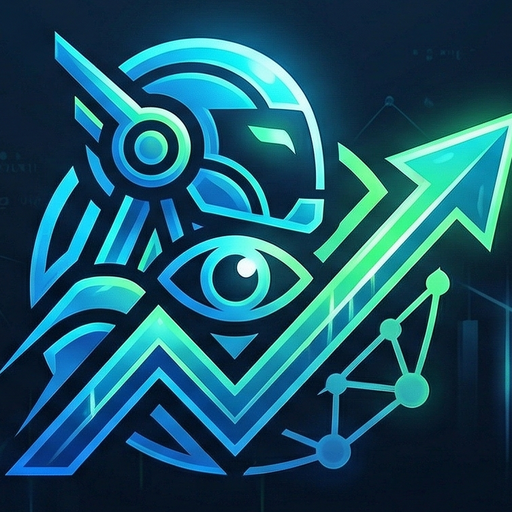

# BotStrike — Algorithmic Trading Terminal

<div align="center">
  
  <br/><br/>
  <strong>Production-grade algorithmic trading system with a professional desktop application.</strong>
  <br/>
  Paper trading on Binance | Real-time microstructure analysis | Cyberpunk UI
  <br/><br/>

  
  
  
  
</div>

---

## Overview

BotStrike is a complete algorithmic trading system combining a battle-tested Python trading engine with a modern Tauri v2 desktop application. The system connects to Binance for real-time market data and executes paper/live trades using custom quantitative strategies.

### Key Features

- **2 Active Strategies**: Mean Reversion (RSI+Bollinger+OBI) & Order Flow Momentum (OBI+Hawkes+Microprice)
- **Advanced Microstructure**: VPIN, Hawkes Process, Kyle Lambda, Avellaneda-Stoikov engine
- **Risk Management**: Kelly Criterion, Volatility Targeting, Drawdown Circuit Breaker, Risk of Ruin
- **Smart Execution**: Fill Probability Model, Queue Position, 8-component Slippage Model
- **Desktop App**: 10 screens, real-time charts, glassmorphism UI, auto-updates
- **153 Tests Passing**: 13 deep audits completed

## Architecture

```
┌─────────────────────────────────────────────┐
│              Tauri Desktop App              │
│  React + TypeScript + TailwindCSS + Recharts│
│  10 screens | TradingView Charts | Alerts   │
└──────────────────┬──────────────────────────┘
                   │ WebSocket + REST
┌──────────────────▼──────────────────────────┐
│           Python Bridge Server              │
│  FastAPI on localhost:9420                   │
│  5 WS channels: market|trading|micro|risk|  │
│                  system                     │
└──────────────────┬──────────────────────────┘
                   │
┌──────────────────▼──────────────────────────┐
│          BotStrike Trading Engine           │
│  89 Python modules | 25K+ lines of code    │
│  Strategies | Risk | Execution | Data       │
└──────────────────┬──────────────────────────┘
                   │ WebSocket
┌──────────────────▼──────────────────────────┐
│         Binance / Strike Finance            │
│  Real-time market data + order execution    │
└─────────────────────────────────────────────┘
```

## Desktop App Screenshots

The desktop application features 10 professional screens:

| Screen | Description |
|--------|-------------|
| **Dashboard** | Portfolio value, strategy allocation donut, positions, signals, microstructure |
| **Live Trading** | TradingView candlestick chart, order book, positions, signal feed |
| **Performance** | Equity curve (Recharts), trade history, strategy breakdown |
| **Order Flow** | VPIN gauge, Hawkes intensity, Kyle Lambda, A-S spread, risk score |
| **Strategies** | Strategy cards with allocation, status, parameters |
| **Risk Monitor** | Circuit breaker, drawdown gauge, Kelly, exposure |
| **Backtesting** | Configure & run backtests, equity curve results |
| **Market Data** | Live feed monitor, WS channel status, data catalog |
| **Settings** | Capital, risk, symbols, execution, notifications, theme |
| **System** | Engine controls, connection status, live logs |

## Installation

### Desktop App (Recommended)

Download the latest installer from [Releases](../../releases/latest):

- **Windows MSI**: `BotStrike_x.x.x_x64_en-US.msi`
- **Windows NSIS**: `BotStrike_x.x.x_x64-setup.exe`

The installer includes the Python trading engine — no Python installation needed.

### Development Setup

```bash
# Clone
git clone https://github.com/FomoDonkey/BotStrike.git
cd BotStrike

# Python backend
pip install -r requirements.txt

# Desktop frontend
cd desktop
npm install

# Run (2 terminals)
# Terminal 1: Bridge server
python -m server.bridge

# Terminal 2: Desktop app
cd desktop
npm run tauri:dev
```

## Configuration

Copy `.env.example` to `.env` and set your keys:

```env
STRIKE_PUBLIC_KEY=your_key
STRIKE_PRIVATE_KEY=your_key
TELEGRAM_BOT_TOKEN=your_bot_token
TELEGRAM_CHAT_ID=your_chat_id
```

### Trading Parameters

| Parameter | Default | Description |
|-----------|---------|-------------|
| Initial Capital | $300 | Starting capital |
| Max Drawdown | 10% | Circuit breaker threshold |
| Max Leverage | 5x | Position leverage cap |
| Risk per Trade | 1.5% | Kelly-bounded risk budget |
| Slippage Model | 8 bps | 8-component realistic model |
| Vol Target | 15% annual | Portfolio volatility target |

## Usage

### Paper Trading (Terminal)

```bash
python main.py --paper              # Paper trading with Binance data
python main.py --backtest-realistic # Tick-by-tick backtesting
python main.py --collect-data       # Start data collector
python main.py --analytics          # Performance analysis
```

### Desktop App

Just open BotStrike from your desktop. The app automatically:
1. Launches the Python engine as a background process
2. Connects to Binance WebSocket for real-time data
3. Starts paper trading with configured strategies
4. Shows real-time data across all 10 screens

### Auto-Updates

The app checks for updates on startup. When a new version is available, a dialog prompts you to download and install — no manual reinstallation needed.

## Strategies

### Mean Reversion (40% allocation)
- **Signal**: RSI extremes (<30/>70) + Bollinger Band + OBI confirmation
- **Timeframe**: 15-minute bars (auto-resampled from 1m)
- **SL/TP**: 1.5x / 3.0x ATR
- **Filter**: VPIN toxicity, Hawkes spike, risk score

### Order Flow Momentum (60% allocation)
- **Signal**: Weighted scoring — OBI (40%) + Microprice (30%) + Hawkes (20%) + Depth (10%)
- **Hold time**: 30-180 seconds (scalping)
- **Evaluation**: Every 5 seconds with 60s cooldown
- **Trend**: 4H + 1D Binance klines for macro bias

## Tech Stack

| Layer | Technology |
|-------|-----------|
| Desktop Shell | Tauri v2 (Rust) |
| Frontend | React 18, TypeScript, Tailwind CSS v4 |
| Charts | TradingView Lightweight Charts, Recharts |
| State | Zustand (throttled 4/sec) |
| Animations | Framer Motion |
| Bridge | FastAPI + WebSocket (Python) |
| Engine | Python 3.12, asyncio, numpy, pandas |
| Data | SQLite (trades), Parquet (market data) |
| Exchange | Binance WebSocket, Strike Finance REST |
| CI/CD | GitHub Actions, Tauri auto-updater |
| Packaging | PyInstaller (engine), MSI/NSIS (installer) |

## Project Structure

```
BotStrike/
├── desktop/               # Tauri + React desktop app
│   ├── src/               # React frontend (29 files)
│   └── src-tauri/         # Rust shell + config
├── server/                # FastAPI bridge server
│   ├── bridge.py          # WebSocket + REST bridge
│   └── serializers.py     # Type serializers
├── core/                  # Trading engine core
│   ├── microstructure.py  # VPIN, Hawkes, Kyle Lambda, A-S
│   ├── market_data.py     # OHLCV collector
│   ├── indicators.py      # ATR, RSI, ADX, Bollinger, OBI
│   └── quant_models.py    # Kelly, Vol Target, RoR, Monte Carlo
├── strategies/            # Trading strategies
├── risk/                  # Risk management
├── execution/             # Order execution + smart routing
├── exchange/              # Binance + Strike Finance clients
├── backtesting/           # Backtester + optimizer
├── trade_database/        # SQLite persistence
├── data/                  # Market data (Parquet)
├── .github/workflows/     # CI/CD pipelines
└── tests/                 # 153 tests
```

## CI/CD

- **CI** (`ci.yml`): TypeScript check + Python bridge verify + Cargo check on every push to `main`
- **Release** (`release.yml`): On `v*` tag push — builds PyInstaller engine + Tauri app, signs artifacts, creates GitHub Release with auto-update manifest

## License

Private repository. All rights reserved.
